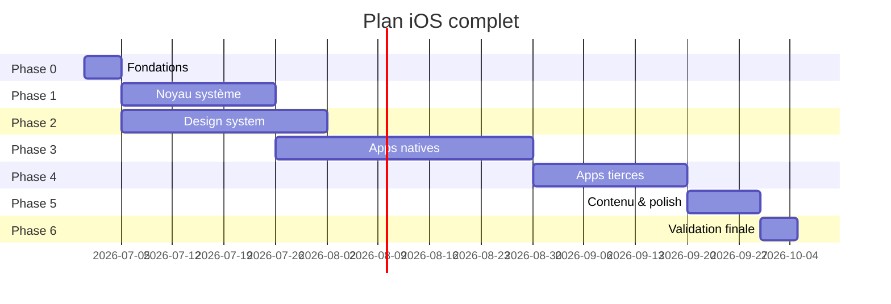

# Plan — iOS complet pour Lost Phone

> **Objectif final :** sur `/simulator`, un iPhone vide se comporte et se voit comme un vrai iPhone iOS 17 (iPhone 15 Pro, 393×852). Les histoires LPSP n’injectent que du contenu — jamais de structure UI.

**Durée estimée :** 12–16 semaines de dev focalisé (1 dev à temps plein), ou 6–8 semaines à 2 devs en parallèle (noyau + design system).

---

## Définition de « iOS complet »

À la fin du plan, **tout** ce qui suit doit être validé sur `/simulator` + `/ui-reference` :

### Noyau système
- [ ] Verrou (vide, avec notifs, widgets si capture dispo)
- [ ] Déverrouillage : swipe, PIN, Face ID (animation + succès/échec)
- [ ] Accueil : grille 4×N, dock, pager, recherche Spotlight, indicateur pages
- [ ] Status bar + Dynamic Island (états : normal, app, CC ouvert)
- [ ] Centre de notifications (depuis verrou + accueil)
- [ ] Centre de contrôle (toutes tuiles, sliders, modules)
- [ ] Gestes : swipe unlock, NC haut, CC coin droit, home indicator, swipe back app
- [ ] Transitions : ouverture/fermeture app (spring + scale depuis icône), overlay fade
- [ ] Clavier système AZERTY (saisie réelle dans champs)
- [ ] Alert, ActionSheet, Sheet, ContextMenu, Popover
- [ ] Haptiques + feedback visuel au toucher (opacity/scale)
- [ ] Mode clair/sombre cohérent par contexte

### Design system
- [ ] Bibliothèque unique — **zéro** style ad hoc dans les apps
- [ ] Tous les composants listés dans [CATALOG.md](./src/platform/design-system/CATALOG.md) implémentés et calibrés
- [ ] Tokens HIG finalisés (`tokens.css`, `hig.css`) — plus de valeurs magiques

### Apps natives (12)
Chaque app : écrans principaux + états vides + navigation interne + calibrage capture.

| App | Écrans minimum |
|-----|----------------|
| Réglages | Main + 2 sous-pages (Général, Wi-Fi) |
| Messages | Liste + conversation + composer |
| Photos | Bibliothèque + albums + détail |
| Téléphone | Récents + clavier + contact |
| Contacts | Liste + fiche |
| Mail | Inbox + message + composer |
| Notes | Liste + éditeur |
| Calendrier | Mois + jour |
| Safari | Accueil + onglet |
| Fichiers | Navigateur |
| Rappels | Liste |
| Plans | Carte + fiche lieu |

### Apps tierces (7+)
| App | Écrans minimum |
|-----|----------------|
| WhatsApp | Liste + conversation |
| Signal | Liste + conversation |
| Instagram | Feed + DM |
| Uber | Accueil |
| Spotify | Accueil |
| Netflix | Profils + accueil |
| Crédit Agricole | Compte |
| *(option)* X, Discord, Google | Selon besoins histoires |

### Couche contenu
- [ ] Adapters LPSP stables — changement de contenu sans toucher aux apps
- [ ] Scénario (notifs live) fonctionne sans casser le rendu
- [ ] Test j3-louvre : même rendu que simulateur, contenu Mathieu

---

## Méthode invariante (chaque tâche)

```
Capture PNG  →  inventaire éléments  →  assets exacts  →  mesure pixel  →  implémentation
     →  /ui-reference overlay 50 %  →  correction élément par élément  →  validation utilisateur « OK »
```

**Interdit :**
- Développer un écran sans capture de référence
- Passer à l’écran suivant sans validation explicite
- Utiliser des dégradés CSS quand la capture montre une photo
- Inventer des composants « iOS-like » (CC, NC, PIN, accueil…) sans les découper depuis la capture

**Gate de validation :** overlay à 50 % — quasi impossible de distinguer React vs iPhone.  
Voir **[CALIBRATION.md](./CALIBRATION.md)** pour la file d’attente noyau.

---

## Vue d’ensemble des phases



Les phases 1 et 2 se chevauchent partiellement dès la semaine 2.

---

## Phase 0 — Fondations (5 jours)

**But :** outillage et structure prêts pour scaler.

| # | Tâche | Livrable |
|---|-------|----------|
| 0.1 | Compléter les captures manquantes (voir liste § Captures) | PNG dans `public/captures-ios/` |
| 0.2 | `npm run captures:status` → 100 % vert sur les écrans du plan | Rapport OK |
| 0.3 | Migrer `src/ios/` → `src/platform/kernel/` (imports mis à jour) | Structure cible |
| 0.4 | Migrer `src/ios/ui/` → `src/platform/design-system/` | Structure cible |
| 0.5 | Page `/ui-reference` : checklist par écran (validé / en cours) | Suivi visuel |
| 0.6 | Documenter tokens dans `hig.css` (source unique) | Tokens figés |

**Critère de fin phase 0 :** `/simulator` et `/ui-reference` fonctionnent ; arborescence `platform/` en place.

---

## Phase 1 — Noyau système (3 semaines)

**But :** iPhone vide crédible avant toute app.

### Semaine 1 — Chrome & verrou

| # | Écran / composant | Capture | Tâches |
|---|-------------------|---------|--------|
| 1.1 | Status bar | toutes `system.*` | Heure, carrier, icônes signal/WiFi/batterie % exact |
| 1.2 | Dynamic Island | toutes `system.*` | Pilule, ombre, position |
| 1.3 | Verrou vide | `system.lock-vide` | Horloge SF Rounded, date, fond, torche/camera |
| 1.4 | Verrou notifs | `system.lock-notifs` | Cartes notif blur, stack, coins |
| 1.5 | Swipe unlock | *(vidéo ref)* | Rubber band, hint fade, spring |
| 1.6 | Home indicator | toutes | Position, taille, hit area |

### Semaine 2 — Accueil & sécurité

| # | Écran / composant | Capture | Tâches |
|---|-------------------|---------|--------|
| 1.7 | Accueil p1 | `system.home-p1` | Grille icônes, labels, espacements |
| 1.8 | Accueil p2 | `system.home-p2` | Pager dots, swipe inter-pages |
| 1.9 | Dock | `system.home-p1` | Glass blur, radius, icônes plus grandes |
| 1.10 | Spotlight / recherche | *(capture à ajouter)* | Pill blur sous dock |
| 1.11 | Code PIN | `system.pin` | Points, clavier, shake erreur |
| 1.12 | Face ID | *(capture à ajouter)* | Animation scan + succès/échec |

### Semaine 3 — Overlays & gestes

| # | Écran / composant | Capture | Tâches |
|---|-------------------|---------|--------|
| 1.13 | Centre de notifications | `system.notification-center` | Blur, widgets, stack notifs |
| 1.14 | Centre de contrôle | `system.control-center` | Modules connectivité, media, sliders |
| 1.15 | Gestes NC/CC | — | Zones touch, seuils swipe |
| 1.16 | Transition open app | *(capture à ajouter)* | Scale depuis icône, spring iOS |
| 1.17 | Transition close app | — | Swipe down depuis top, parallax |
| 1.18 | App en foreground | — | Status bar mode app-light/dark auto |

**Critère de fin phase 1 :** parcours complet `/simulator` : verrou → swipe → PIN → accueil → NC → CC → ouvrir/fermer une app vide → retour verrou. Chaque étape validée en overlay.

---

## Phase 2 — Design system (4 semaines, chevauche phase 1 dès S2)

**But :** bibliothèque exhaustive — les apps ne font que composer.

### Semaine 1 — Fondations DS

| Composant | Priorité | Capture ref |
|-----------|----------|-------------|
| `InsetGroupedList` + `Cell` | P0 | `app.reglages.main` |
| `NavBar` + `LargeTitle` | P0 | Messages, Réglages |
| `Switch` | P0 | Réglages |
| `SearchField` | P0 | Accueil, Messages |
| `SectionHeader` | P0 | Réglages |

### Semaine 2 — Navigation & feedback

| Composant | Priorité | Capture ref |
|-----------|----------|-------------|
| `TabBar` | P0 | Photos, Téléphone |
| `Toolbar` | P1 | Mail, Notes |
| `SegmentedControl` | P1 | App Store style / Maps |
| `Alert` | P0 | *(capture système)* |
| `ActionSheet` | P0 | *(capture système)* |
| `Sheet` | P0 | Partage, options |

### Semaine 3 — Saisie & listes avancées

| Composant | Priorité | Capture ref |
|-----------|----------|-------------|
| `SystemKeyboard` | P0 | Messages composer |
| `TextField` | P0 | Safari, Recherche |
| `PinPad` | P0 | `system.pin` |
| `SwipeActions` | P1 | Mail, Messages |
| `ContextMenu` | P1 | Icône accueil long-press |
| `EditMode` | P2 | Rappels, Notes |

### Semaine 4 — Chat, média, misc

| Composant | Priorité | Capture ref |
|-----------|----------|-------------|
| `ChatThread` + bulles | P0 | `app.messages.conversation` |
| `ChatComposer` | P0 | idem |
| `PhotoGrid` | P0 | `app.photos.bibliotheque` |
| `NotificationCard` | P0 | `system.lock-notifs` |
| `ControlCenterModule` | P0 | `system.control-center` |
| `Avatar` | P1 | Contacts, Messages |
| `Slider` / `Stepper` | P1 | CC, Réglages |

**Critère de fin phase 2 :** page `/design-system` (storybook interne) montrant tous les composants calibrés ; CATALOG.md → 100 % coché.

---

## Phase 3 — Apps natives (5 semaines)

**Ordre strict** — chaque app débloque des patterns pour la suivante.

### Semaine 1 — Réglages + Messages
| App | Écrans | Captures | État vide |
|-----|--------|----------|-----------|
| **Réglages** | Main, Général, Wi-Fi | `app.reglages.main` + sous-captures | Liste complète mock |
| **Messages** | Liste, conversation | `app.messages.liste`, `.conversation` | « Aucun message » |

### Semaine 2 — Photos + Téléphone + Contacts
| App | Écrans | Captures |
|-----|--------|----------|
| **Photos** | Bibliothèque, albums, détail | `app.photos.*` |
| **Téléphone** | Récents, clavier | `app.telephone.recents` + clavier |
| **Contacts** | Liste, fiche | `app.contacts.liste` + fiche |

### Semaine 3 — Mail + Notes + Calendrier
| App | Écrans | Captures |
|-----|--------|----------|
| **Mail** | Inbox, détail, composer | `app.mail.*` |
| **Notes** | Liste, éditeur | `app.notes.*` |
| **Calendrier** | Mois, jour | `app.calendrier.mois` |

### Semaine 4 — Safari + Fichiers + Rappels + Plans
| App | Écrans | Captures |
|-----|--------|----------|
| **Safari** | Accueil, onglet | `app.safari.accueil` |
| **Fichiers** | Browser | `app.fichiers.browser` |
| **Rappels** | Liste | `app.rappels.liste` |
| **Plans** | Carte | `app.maps.carte` |

### Semaine 5 — Refactor apps existantes
| # | Tâche |
|---|-------|
| 3.1 | Supprimer styles ad hoc dans `apps.css` — tout passe par DS |
| 3.2 | Déplacer apps → `src/platform/apps/native/` |
| 3.3 | Interface commune : `AppPluginProps { data: unknown }` + adapters |
| 3.4 | États vides iOS réels pour chaque app sur `/simulator` |

**Critère de fin phase 3 :** les 12 apps natives s’ouvrent sur `/simulator`, naviguent en interne, état vide = iOS réel, chaque écran validé en overlay.

---

## Phase 4 — Apps tierces (3 semaines)

| Semaine | Apps | Captures |
|---------|------|----------|
| S1 | WhatsApp, Signal | `app.whatsapp.*`, `app.signal.*` |
| S2 | Instagram, Uber, Spotify | `app.instagram.*`, `app.uber.accueil`, `app.spotify.accueil` |
| S3 | Netflix, Crédit Agricole + *(X, Discord si besoin)* | captures existantes |

**Règle :** même design system pour listes/nav/sheets ; seuls tokens thème (couleurs, icônes) changent.

**Critère de fin phase 4 :** toutes les apps du registry ouvrent sur `/simulator` avec mock vide, calibrées.

---

## Phase 5 — Contenu & polish (2 semaines)

| # | Tâche |
|---|-------|
| 5.1 | Adapters LPSP : une fonction par app, tests avec j3-louvre |
| 5.2 | Scénario : notifs live sans glitch visuel |
| 5.3 | Performance : 60 fps transitions, pas de jank scroll |
| 5.4 | Accessibilité minimale : focus, aria labels système |
| 5.5 | Capacitor iOS : safe areas, status bar native, haptics |
| 5.6 | Supprimer code mort : `src/os/`, `CaptureScreen.tsx`, `GenericApp` dump |

**Critère de fin phase 5 :** `/phone/j3-louvre` indiscernable de `/simulator` + contenu Mathieu.

---

## Phase 6 — Validation finale (1 semaine)

### Parcours de test « utilisateur sceptique »

1. Ouvrir `/simulator` — impression iPhone réel dès le verrou
2. Déverrouiller (PIN 0000) — animation fluide
3. Parcourir 2 pages accueil — dock, pager OK
4. Ouvrir NC, CC — blur et tuiles exacts
5. Ouvrir Messages, Photos, Réglages, Instagram — navigation complète
6. Revenir accueil via home indicator
7. Répéter sur `/phone/j3-louvre` — même ressenti, contenu différent
8. Tester sur iPhone physique via Capacitor

### Checklist finale (100 % requis)

- [ ] 36+ captures référencées et calibrées
- [ ] 0 styles ad hoc hors design system
- [ ] `/simulator` utilisable sans doc
- [ ] j3-louvre jouable sans régression visuelle
- [ ] ARCHITECTURE.md + CATALOG.md à jour

---

## Captures à ajouter (Phase 0)

Ces captures manquent aujourd’hui mais sont **bloquantes** pour un iOS complet :

| ID proposé | Écran | Usage |
|------------|-------|-------|
| `system.face-id` | Face ID prompt | Déverrouillage biométrique |
| `system.spotlight` | Recherche accueil | Pill Spotlight |
| `system.alert` | UIAlertController | Alertes système |
| `system.action-sheet` | Action sheet | Menus bas |
| `system.sheet` | Bottom sheet | Partage, options |
| `system.keyboard` | Clavier AZERTY | Saisie |
| `system.app-open` | App en ouverture | Transition scale |
| `system.context-menu` | Long press icône | Menu contextuel |
| `app.reglages.general` | Réglages › Général | Sous-page |
| `app.reglages.wifi` | Réglages › Wi-Fi | Sous-page |
| `app.telephone.keypad` | Clavier numérique | App Téléphone |
| `app.contacts.detail` | Fiche contact | Détail |
| `app.safari.tab` | Safari onglet | Navigation web |
| `app.calendrier.jour` | Calendrier jour | Vue jour |

**Procédure :** AirDrop PNG → `inbox/` → `npm run captures:sort` → `captures:apply` → `reference:measure`.

---

## Organisation du travail

### Routes de dev

| Route | Quand l’utiliser |
|-------|------------------|
| `/simulator` | Développement quotidien (iPhone vide) |
| `/ui-reference` | Validation visuelle vs capture |
| `/design-system` | *(à créer phase 2)* Vitrine composants |
| `/phone/j3-louvre` | Test contenu histoire |

### Priorités si le temps manque

1. **Non négociable :** Phase 1 (noyau) + Messages + Photos + Réglages + WhatsApp
2. **Important :** reste apps natives + Instagram + Signal
3. **Optionnel v1 :** X, Discord, Google, sous-pages Réglages multiples

---

## Résumé exécutif

| Phase | Durée | Résultat |
|-------|-------|----------|
| 0 Fondations | 5 j | Outillage + structure + captures |
| 1 Noyau | 3 sem | iPhone vide crédible |
| 2 Design system | 4 sem | Bibliothèque complète |
| 3 Apps natives | 5 sem | 12 apps iOS |
| 4 Apps tierces | 3 sem | 7+ apps |
| 5 Contenu | 2 sem | LPSP + polish |
| 6 Validation | 1 sem | Go production |
| **Total** | **~16 sem** | **iOS complet** |

À l’issue de ce plan, Lost Phone **est** un simulateur iOS fonctionnel dans lequel les histoires ne sont que des fichiers de données.

---

## Prochaine action immédiate

**Phase 0.1 + Phase 1.1–1.3 :** compléter captures manquantes système, puis calibrer status bar + Dynamic Island + verrou vide sur `/ui-reference`.

Dis-moi si tu veux qu’on démarre directement la Phase 0 ou qu’on attaque Phase 1.1 (status bar) avec les captures actuelles.
